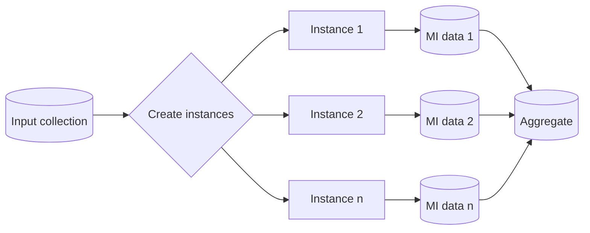

---
title: "Multiple Instance Data"
category: "[[Data/_Data Patterns|Data Patterns]]"
group: "Visibility Patterns"
---
Intent: Represent data that belongs to one instance inside a multiple-instance activity, distinct from the data of sibling instances.

Use when: A repeated task or subprocess needs each instance to carry its own item, partial result, status, or local decision.

Modeling notes: Model an instance key or index. Distinguish per-instance data from aggregate data so updates from one instance cannot accidentally overwrite another instance's state.

Source: [workflowpatterns.com](http://workflowpatterns.com/patterns/data/visibility/wdp4.php).
