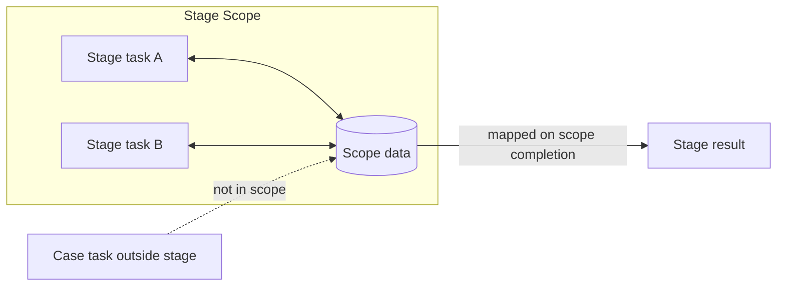

---
title: "Scope Data"
category: "[[Data/_Data Patterns|Data Patterns]]"
group: "Visibility Patterns"
---
Intent: Represent data visible to all tasks in a defined workflow scope, such as a subprocess, stage, or region.

Use when: Several activities in the same modeled scope require shared state, but that state should not be visible across the entire case or workflow definition.

Modeling notes: Define the scope boundary first, then attach the data to that boundary. Use scope data for cohesive stage-level concerns, not as a convenient substitute for case-wide data.

Source: [workflowpatterns.com](http://workflowpatterns.com/patterns/data/visibility/wdp3.php).
