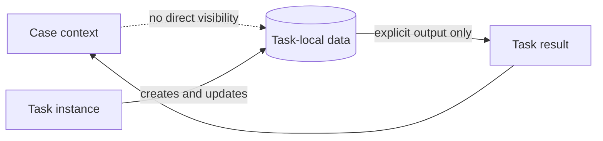

---
title: "Task Data"
category: "[[Data/_Data Patterns|Data Patterns]]"
group: "Visibility Patterns"
---
Intent: Represent data that is local to a single task instance and invisible to the surrounding workflow except through explicit outputs.

Use when: A task needs scratch values, user-entry fields, calculated intermediates, or implementation details that should not leak into the case or workflow context.

Modeling notes: Keep task data separate from case data even when it has the same shape. Promote it only through an outgoing data interaction or transfer rule, and name local variables so it is clear they die with the task instance.

Source: [workflowpatterns.com](http://workflowpatterns.com/patterns/data/visibility/wdp1.php).
