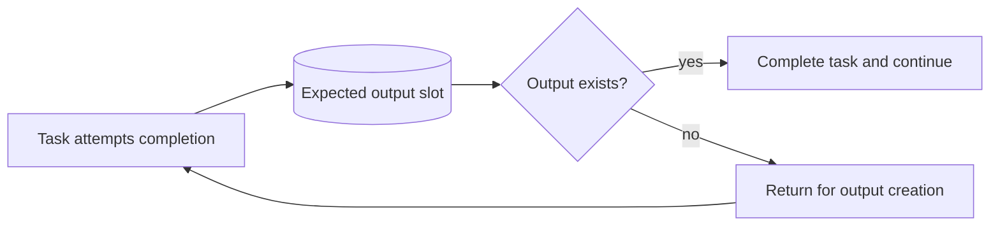

---
title: "Task Postcondition - Data Existence"
category: "[[Data/_Data Patterns|Data Patterns]]"
group: "Data-Driven Routing and Trigger Patterns"
---
Intent: Treat a task as complete only when required output data exists.

Use when: Completion must be blocked unless a document, result record, audit entry, confirmation, or output object has been produced.

Modeling notes: The task may finish its work steps but still fail the workflow completion condition. Model corrective action for missing outputs.

Source: [workflowpatterns.com](http://workflowpatterns.com/patterns/data/routing/wdp36.php).
