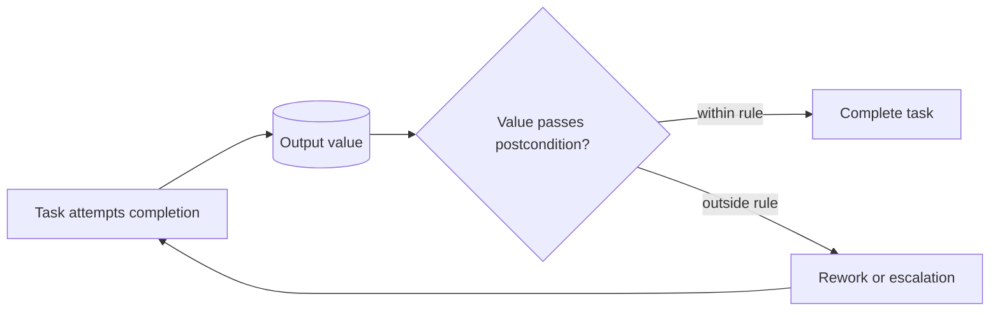

---
title: "Task Postcondition - Data Value"
category: "[[Data/_Data Patterns|Data Patterns]]"
group: "Data-Driven Routing and Trigger Patterns"
---
Intent: Treat a task as complete only when output data has an acceptable value.

Use when: A task must produce a valid status, non-empty result, passing score, accepted decision, or value within defined limits before the workflow can proceed.

Modeling notes: Separate task execution from completion validation. Model rejection, correction, escalation, or rework when the postcondition fails.

Source: [workflowpatterns.com](http://workflowpatterns.com/patterns/data/routing/wdp37.php).
