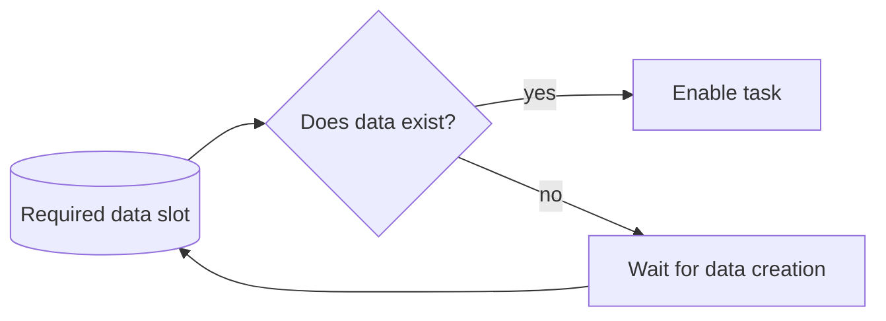

---
title: "Task Precondition - Data Existence"
category: "[[Data/_Data Patterns|Data Patterns]]"
group: "Data-Driven Routing and Trigger Patterns"
---
Intent: Enable a task only when required data exists.

Use when: A task cannot sensibly start until a document, field, record, approval, message, or data object has been created.

Modeling notes: Existence is a structural condition, not a value test. Model where the required data should exist and what waits or retries while it is absent.

Source: [workflowpatterns.com](http://workflowpatterns.com/patterns/data/routing/wdp34.php).
