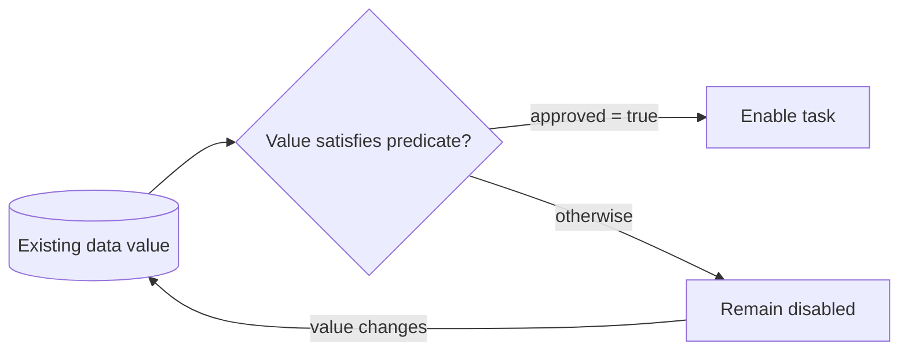

---
title: "Task Precondition - Data Value"
category: "[[Data/_Data Patterns|Data Patterns]]"
group: "Data-Driven Routing and Trigger Patterns"
---
Intent: Enable a task only when existing data has an acceptable value.

Use when: A task should start only after a status, amount, score, risk level, category, or flag satisfies a rule.

Modeling notes: Model the predicate explicitly and include the value source. If the value can change while waiting, define whether the task is enabled once or continuously reevaluated.

Source: [workflowpatterns.com](http://workflowpatterns.com/patterns/data/routing/wdp35.php).
