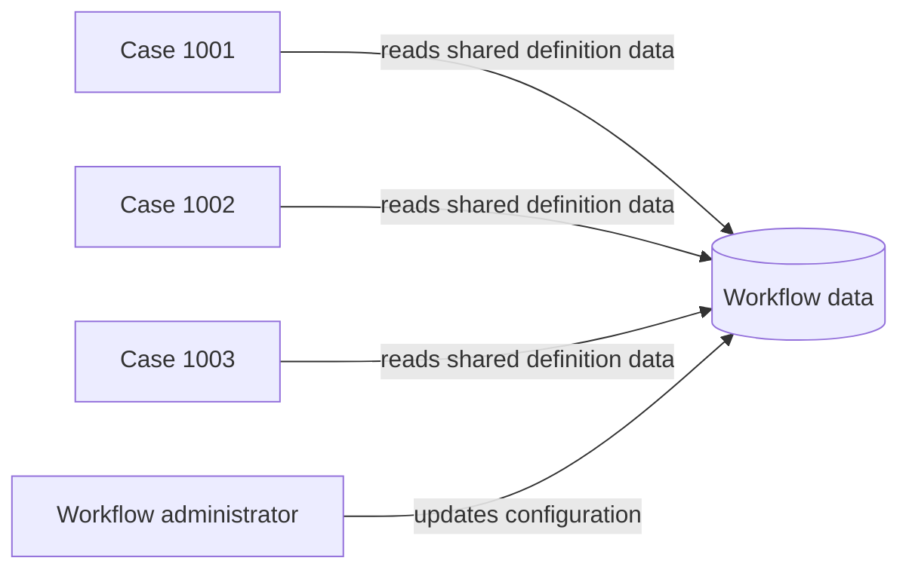

---
title: "Workflow Data"
category: "[[Data/_Data Patterns|Data Patterns]]"
group: "Visibility Patterns"
---
Intent: Represent data available to all cases created from one workflow definition.

Use when: The workflow needs shared configuration, reference tables, thresholds, policy versions, or counters that apply across process instances.

Modeling notes: Do not confuse workflow data with case data. Changes to workflow data can affect many active cases, so model versioning, effective dates, or snapshot behavior where consistency matters.

Source: [workflowpatterns.com](http://workflowpatterns.com/patterns/data/visibility/wdp7.php).
