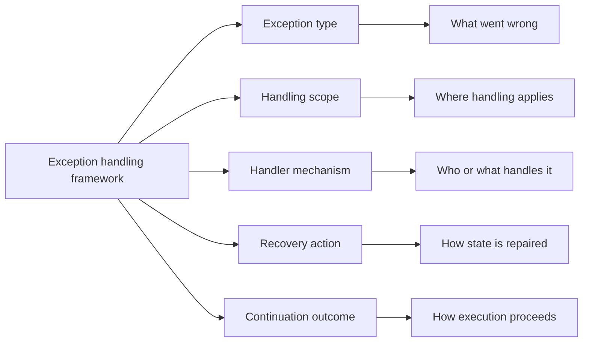

**Intent:** Provide a classification framework for describing exception handling consistently across workflow systems. The framework makes exception handling analyzable by separating exception causes, affected scope, handling mechanisms, recovery behavior, and resumption semantics.

**Use when:** You are comparing workflow engines, documenting exception requirements, or building a modeling guideline for a process portfolio. The framework is most valuable before implementation, because it prevents teams from reducing every exception to a single "catch and retry" construct.

**Modeling notes:** Use the framework as a checklist. For each exception, record what detects it, what part of the workflow it affects, whether the handler is automatic or human-assisted, what recovery options are available, and whether the original work item, subprocess, or whole case remains valid afterward. This keeps framework-level reasoning independent from any particular workflow language.

Source: [workflowpatterns.com](http://workflowpatterns.com/patterns/exception/framework.php).
