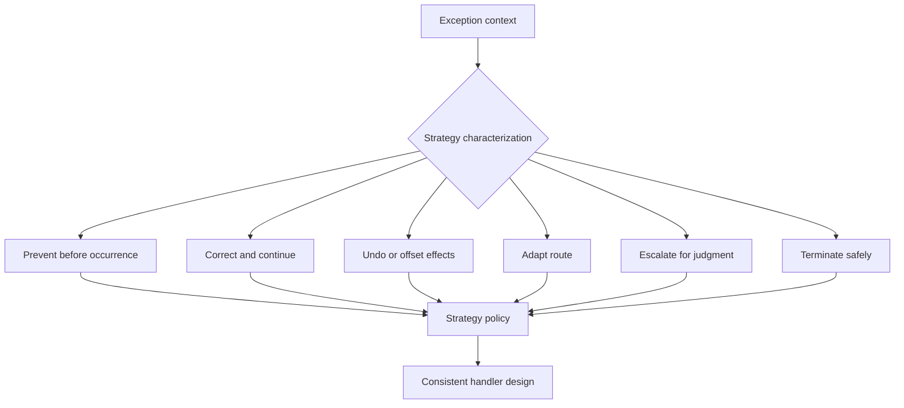

**Intent:** Characterize exception handling strategies by their design posture rather than by individual handler implementations. A strategy describes whether the workflow prefers prevention, correction, compensation, escalation, adaptation, or termination.

**Use when:** You need to reason about the overall exception-handling style of a process, compare alternatives, or explain why different exceptions are handled with different levels of automation and intervention.

**Modeling notes:** Treat strategy as a policy layer above individual actions. For stable and frequent exceptions, prefer automated correction or retry. For high-impact and rare exceptions, prefer escalation, review, or controlled termination. A strategy should be visible in the model so that handlers do not become isolated fragments with inconsistent assumptions.

Source: [workflowpatterns.com](http://workflowpatterns.com/patterns/exception/characterisingstrategies.php).
