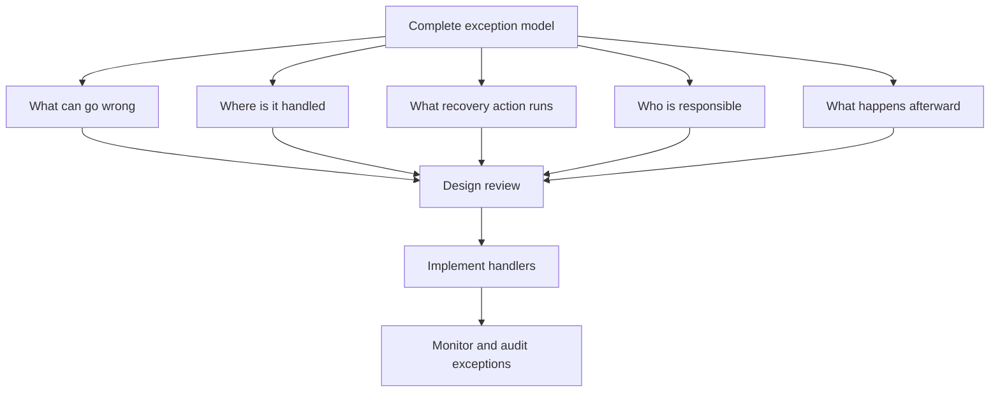

**Intent:** Summarize the practical design lesson: exception handling must be modeled as part of the workflow, with explicit decisions about exception type, scope, handler, recovery action, strategy, language support, and platform capability.

**Use when:** You are closing a design review, writing modeling standards, or checking whether a workflow specification is complete enough for implementation and operation.

**Modeling notes:** A complete exception model should answer five questions: what can go wrong, where is it handled, what action is taken, who is responsible, and what happens to the case afterward. The conclusion should drive the model toward explicit, testable, and auditable exception behavior.

Source: [workflowpatterns.com](http://workflowpatterns.com/patterns/exception/conclusion.php).
