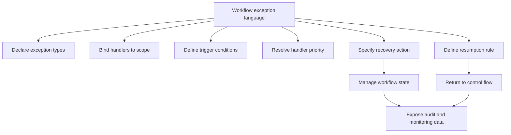

**Intent:** Identify what a workflow exception language must express so that exception handling can be modeled clearly and executed reliably. The language should support domain-level exceptions, scope, handlers, recovery, state management, and interaction with normal control flow.

**Use when:** You are designing a workflow DSL, extending an existing notation, or assessing whether a language can express exception behavior without relying on hidden implementation hooks.

**Modeling notes:** The language should let modelers declare exception types, bind handlers to scopes, specify trigger conditions, define recovery actions, control handler priority, and describe resumption semantics. It should also support human intervention, monitoring, audit data, and compatibility with transactions or compensation where needed.

Source: [workflowpatterns.com](http://workflowpatterns.com/patterns/exception/considerations.php).
