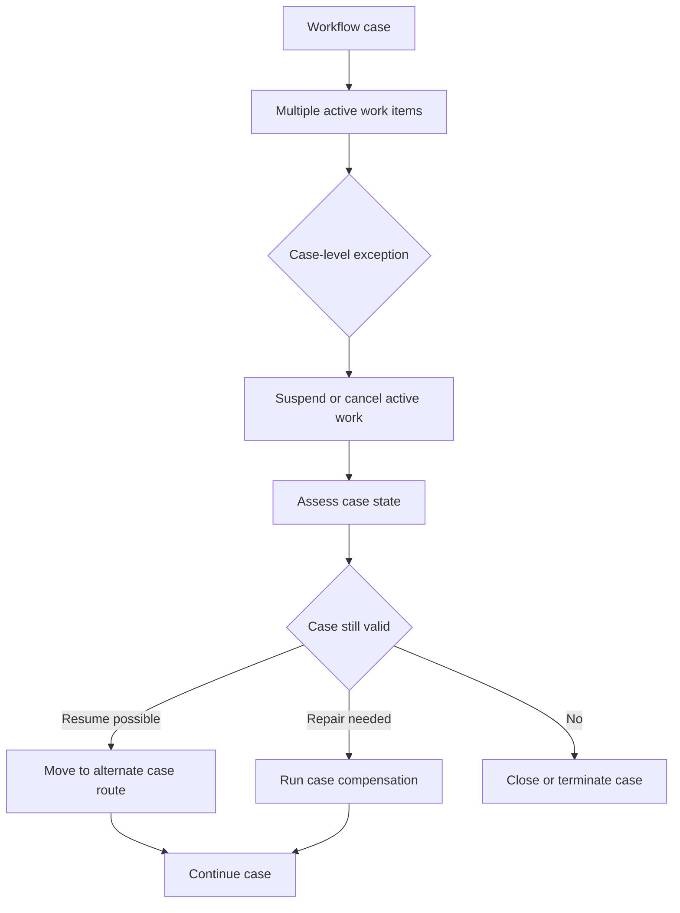

**Intent:** Handle exceptions whose consequences apply to the whole workflow instance, not only to a single task. Case-level handling changes the state, route, or viability of the case.

**Use when:** A disruption invalidates the current case path or requires a coordinated response across multiple active work items. Examples include customer withdrawal, fraud discovery, regulatory hold, global cancellation, or a severe external dependency failure.

**Modeling notes:** Model case-level handlers as explicit case transitions or supervisory regions. They should define how active work items are suspended or cancelled, what state must be preserved, which compensation steps run, and whether the case resumes, restarts, moves to an alternate process, or closes. Case-level handlers need clear precedence over local handlers.

Source: [workflowpatterns.com](http://workflowpatterns.com/patterns/exception/exception_caselevel.php).
