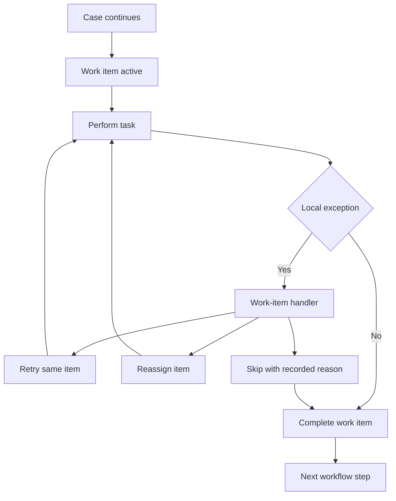

**Intent:** Handle exceptions that are local to a single work item without disturbing the entire case. The work item remains the unit of detection, handling, and recovery.

**Use when:** The exception affects one task instance, one user assignment, one service call, or one local activity outcome. Examples include a task form validation failure, a rejected work item, an unavailable worker, or a failed automated step that can be retried independently.

**Modeling notes:** Keep work-item handlers close to the task they protect. The handler should define whether the work item is retried, reassigned, skipped, rolled back, or completed through an alternate path. Avoid case-wide compensation unless the local failure invalidates broader process state.

Source: [workflowpatterns.com](http://workflowpatterns.com/patterns/exception/exception_workitemlevel.php).
