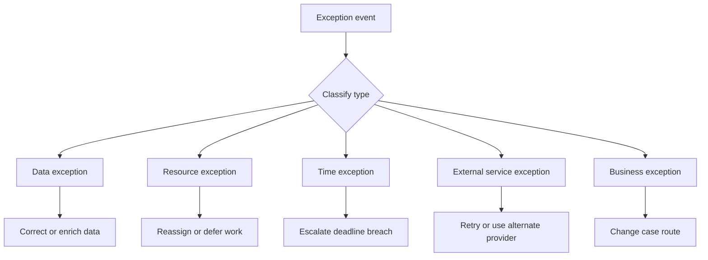

---
title: "Exception Types"
category: "[[Exception Handling/_Exception Handling Patterns|Exception Handling Patterns]]"
---
**Intent:** Distinguish categories of exceptions so that handling logic reflects the actual source of disruption. Exception types can include data issues, resource failures, deadline violations, external service failures, process deviations, and explicit business exceptions.

**Use when:** A workflow model contains many failure conditions and the team needs to avoid one generic handler that either does too much or hides important business distinctions. Typed exceptions also help when different roles own different failures.

**Modeling notes:** Model exception types at the same level of meaning as the process model. Technical failures may be captured as service exceptions, while business situations such as "claim disputed" or "order cancelled by customer" should be named in domain terms. Keep type definitions stable enough for reporting and audit, but specific enough to route to the right handler.

Source: [workflowpatterns.com](http://workflowpatterns.com/patterns/exception/exceptiontypes.php).
