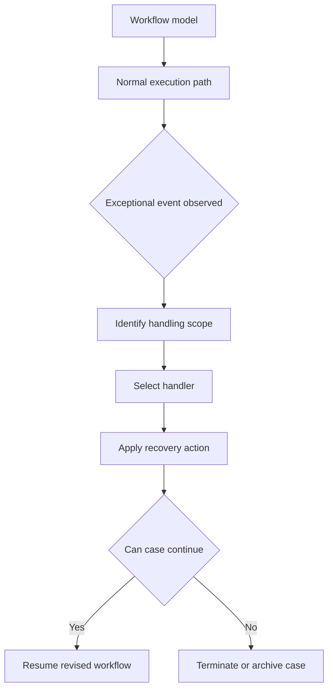

**Intent:** Establish exception handling as a first-class workflow modeling topic. The introduction separates normal control-flow design from the exceptional paths that interrupt, repair, compensate, escalate, or terminate workflow execution.

**Use when:** You need a shared vocabulary before selecting concrete exception patterns. This is useful when a workflow team is deciding whether failures are merely implementation errors, business exceptions, human work exceptions, external-service interruptions, or case-wide process deviations.

**Modeling notes:** Start by modeling the normal process path, then identify the points where reality can diverge from that path. For each divergence, capture the trigger, scope, handler, recovery action, and continuation rule. Avoid treating all exceptions as equivalent; a late approval, a failed service call, and a withdrawn case require different models even if the engine exposes them through the same technical exception mechanism.

Source: [workflowpatterns.com](http://workflowpatterns.com/patterns/exception/introduction.php).
