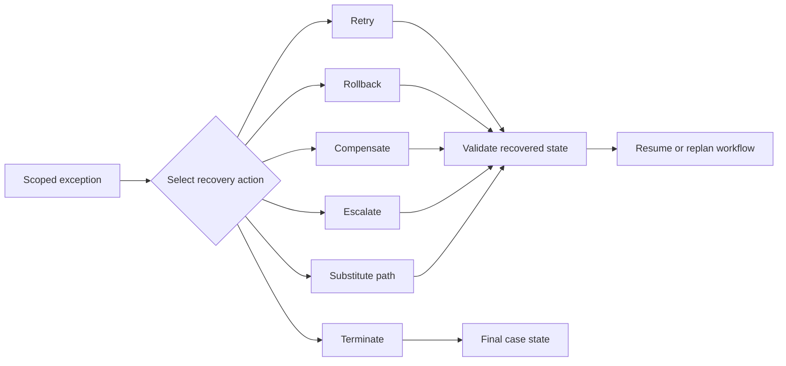

---
title: "Recovery Action"
category: "[[Exception Handling/_Exception Handling Patterns|Exception Handling Patterns]]"
---
**Intent:** Describe the concrete action taken after an exception has been detected and scoped. Recovery action turns exception classification into executable or assignable behavior.

**Use when:** The model already knows that an exception occurred, but the appropriate response is still ambiguous. Recovery actions are needed for retries, rollbacks, compensation, rework, escalation, substitution, manual intervention, and controlled termination.

**Modeling notes:** Make recovery actions explicit and auditable. A recovery action should define its preconditions, responsible actor, state changes, timeout rules, and exit conditions. Recovery can restore the prior state, move the case to a new valid state, or conclude that no valid continuation exists.

Source: [workflowpatterns.com](http://workflowpatterns.com/patterns/exception/recoveryaction.php).
