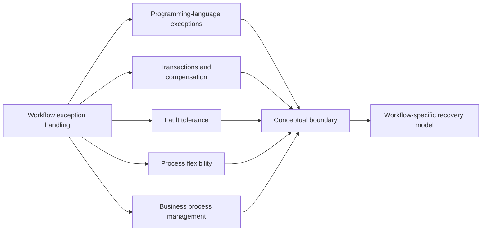

---
title: "Related Work"
category: "[[Exception Handling/_Exception Handling Patterns|Exception Handling Patterns]]"
---
**Intent:** Place workflow exception handling in relation to adjacent bodies of work such as programming-language exceptions, transactions, compensation, fault tolerance, process flexibility, and business process management research.

**Use when:** You need conceptual grounding beyond a single workflow engine or pattern catalog. Related work helps distinguish workflow exceptions from ordinary software exceptions and shows where ideas such as compensation and long-running transactions enter workflow modeling.

**Modeling notes:** Use related work to clarify borrowed concepts, but do not copy programming-language exception semantics directly into workflow models. Workflow exceptions often involve people, deadlines, external organizations, partial completion, and long-running state. The model must therefore support socio-technical recovery, not only stack unwinding.

Source: [workflowpatterns.com](http://workflowpatterns.com/patterns/exception/relatedwork.php).
