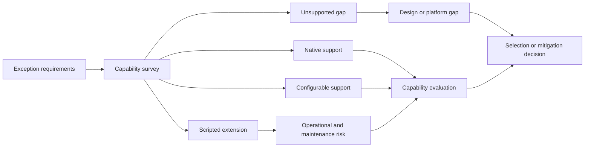

---
title: "Survey of Exception Handling Capabilities"
category: "[[Exception Handling/_Exception Handling Patterns|Exception Handling Patterns]]"
---
**Intent:** Evaluate how well workflow systems support exception handling concepts. A capability survey checks whether an engine can express exception types, scopes, handlers, recovery actions, escalation, compensation, and continuation semantics.

**Use when:** You are selecting a workflow platform, validating a modeling language, or identifying gaps between process requirements and engine features. This is especially important when business exceptions must be modeled transparently instead of buried in custom code.

**Modeling notes:** Survey capabilities against representative exception scenarios, not only against a feature list. Include work-item exceptions, case-level exceptions, automatic recovery, human intervention, compensation, audit, monitoring, and reporting. Record whether each capability is native, configurable, scripted, or unsupported.

Source: [workflowpatterns.com](http://workflowpatterns.com/patterns/exception/survey.php).
