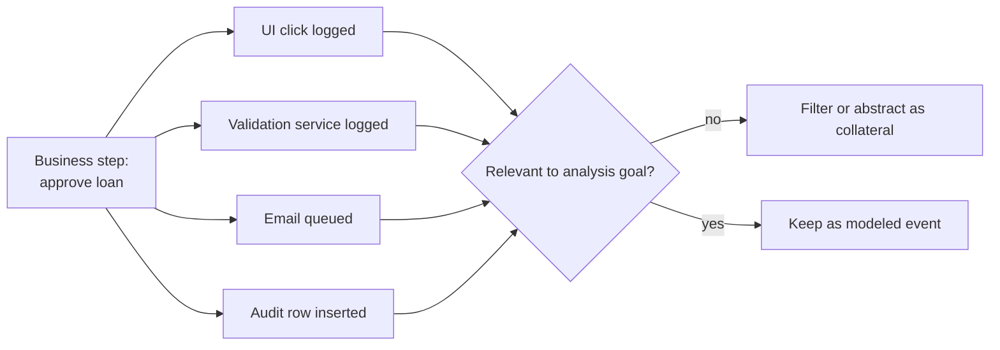

Collateral events are technically correct records that are too fine-grained or incidental for the process question being asked. They describe clicks, validations, notifications, background updates, or system messages around a business step and can drown out the activity structure.

**Intent:** Distinguish analytically relevant process events from supporting or side-effect events generated around the same step.

**Use when:** A trace contains many low-level records for one business action, and including all of them produces a noisy model dominated by implementation detail.

**Modeling notes:** Do not delete collateral events blindly; they may matter for automation, compliance, or performance diagnostics. For control-flow discovery, abstract them into the business event they support or filter them with an explicit scope rule.

Source: [workflowpatterns.com](http://workflowpatterns.com/patterns/logimperfection/elp7.php).
