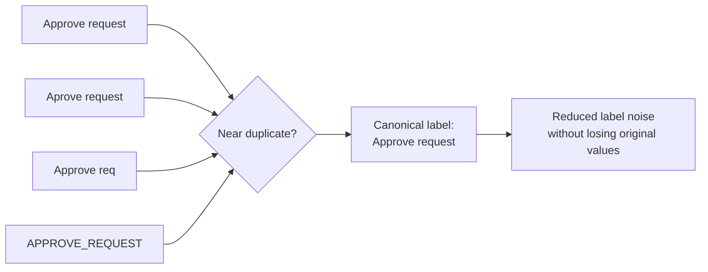

A distorted label is a corrupted variant of the intended activity name. Typographical errors, casing differences, truncation, encoding mistakes, or inconsistent separators create labels that are syntactically close and semantically equivalent but not equal.

**Intent:** Normalize accidental label variants without collapsing genuinely different activities.

**Use when:** The log contains near-duplicates such as `Approve request`, `Approve Request`, `Aprove request`, and `Approve req`, especially when they occur in the same process position.

**Modeling notes:** Combine syntactic similarity with behavioral context. String distance alone can merge labels that look similar but mean different things. Keep a controlled mapping from observed distorted labels to the canonical activity name.

Source: [workflowpatterns.com](http://workflowpatterns.com/patterns/logimperfection/elp9.php).
