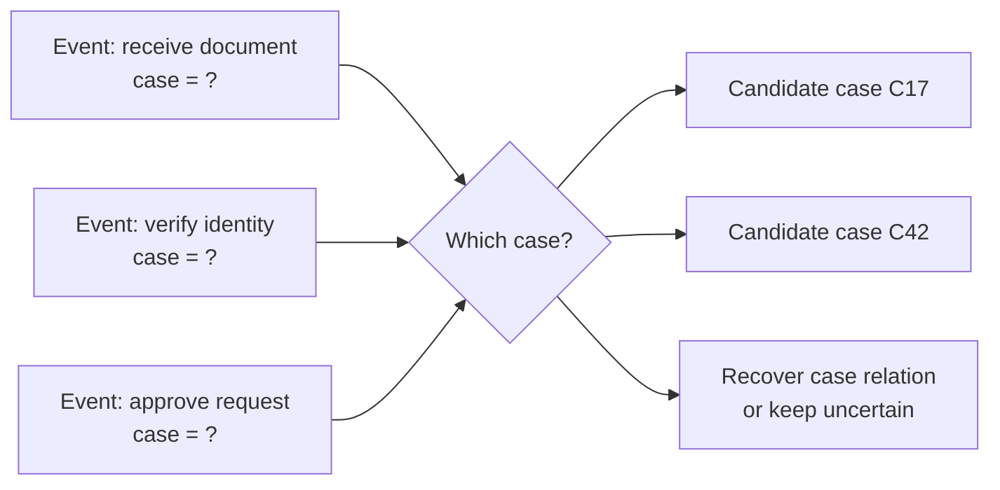

An elusive case is a case-correlation problem where events have no reliable case identifier. The events are present, but the process instance they belong to is missing, hidden, or only inferable from other attributes.

**Intent:** Recover or model the relationship between events and process instances when the case identifier is absent or unusable.

**Use when:** Events include activity, timestamp, and resource data, but no field consistently identifies the process instance, order, patient visit, claim, ticket, or order lifecycle being analyzed.

**Modeling notes:** Case reconstruction is an assumption-heavy repair. Prefer explicit correlation rules, object identifiers, business keys, and domain constraints over clustering alone. When several assignments are plausible, preserve uncertainty or report sensitivity of mining results to the chosen correlation method.

Source: [workflowpatterns.com](http://workflowpatterns.com/patterns/logimperfection/elp5.php).
