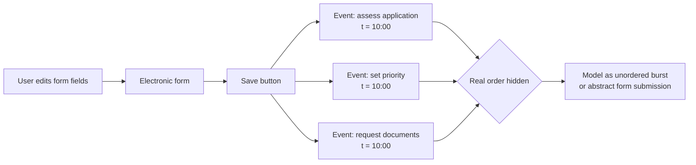

---
title: "Form-based Event Capture"
category: "[[Log Imperfection/_Log Imperfection Patterns|Log Imperfection Patterns]]"
---
Form-based event capture occurs when a user interface stores several field changes as events only when a form is submitted. The log receives a burst of events with the same timestamp, even though the work represented by those fields happened before the Save action and may have happened in a meaningful order.

**Intent:** Detect and model the loss of temporal order caused by form submission semantics, especially when one screen update is expanded into multiple process events.

**Use when:** Several activities in the same case share an identical timestamp, are produced by the same resource or screen, and appear to originate from a single form save rather than from independent process steps.

**Modeling notes:** Treat the Save operation as the capture moment, not necessarily the execution moment. Avoid inferring a strict sequence between same-timestamp form events unless domain rules justify it. Depending on the analysis goal, either collapse the burst into one higher-level event, preserve it as an unordered block, or enrich it with field-level audit data.

Source: [workflowpatterns.com](http://workflowpatterns.com/patterns/logimperfection/elp1.php).
