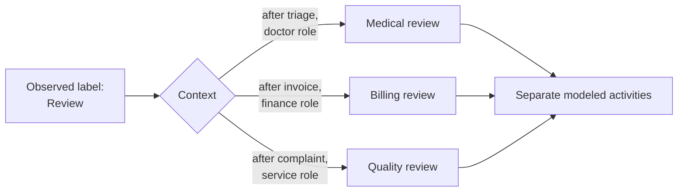

---
title: "Homonymous Label"
category: "[[Log Imperfection/_Log Imperfection Patterns|Log Imperfection Patterns]]"
---
A homonymous label is one activity name used for different process steps. The label looks clean, but it hides multiple meanings, such as `Review` meaning clinical review in one part of a hospital process and billing review in another.

**Intent:** Split a shared label into distinct activity identities when the same name denotes different work.

**Use when:** The same activity label appears in different trace positions, with different resources, objects, input data, or outcomes, and treating it as one step creates an overly connected or misleading model.

**Modeling notes:** Use context to disambiguate: predecessor and successor activities, resource role, department, object type, lifecycle phase, and payload attributes. The repair is a split, not a rename; each resulting label should represent a coherent business activity.

Source: [workflowpatterns.com](http://workflowpatterns.com/patterns/logimperfection/elp11.php).
