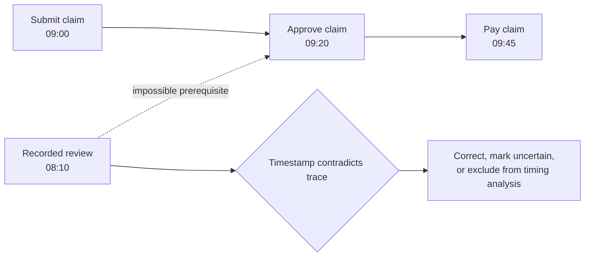

---
title: "Inadvertent Time Travel"
category: "[[Log Imperfection/_Log Imperfection Patterns|Log Imperfection Patterns]]"
---
Inadvertent time travel is a timestamp error that sends an event to an impossible place in the trace. A typo, date-format mismatch, timezone mistake, midnight boundary, or system clock problem can make an event appear before its prerequisite or after a consequence that could not have occurred yet.

**Intent:** Identify records whose timestamps contradict the process semantics strongly enough that the recorded time should be distrusted.

**Use when:** A trace shows impossible temporal order, such as approval before submission, discharge before admission, or a completion event dated months before its start.

**Modeling notes:** Separate "rare but possible" behavior from impossible chronology. Repair should be grounded in constraints such as lifecycle transitions, business rules, source-system audit trails, or neighboring events. Do not simply sort by timestamp if sorting makes the trace semantically absurd.

Source: [workflowpatterns.com](http://workflowpatterns.com/patterns/logimperfection/elp2.php).
