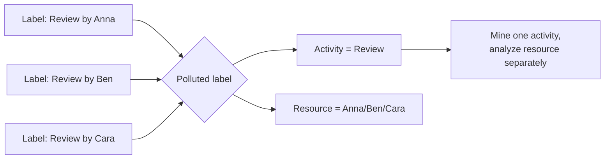

---
title: "Polluted Label"
category: "[[Log Imperfection/_Log Imperfection Patterns|Log Imperfection Patterns]]"
---
A polluted label is an activity name contaminated by another attribute, such as resource, department, status, channel, or free-text context. The result is an artificial explosion of activity labels that should have been one activity plus separate attributes.

**Intent:** Restore the activity identity by separating the activity label from attributes that were encoded into the label field.

**Use when:** Labels follow a pattern such as `Review by Anna`, `Review by Ben`, `Review - urgent`, or `Review / branch-12`, and those suffixes represent attributes rather than distinct activities.

**Modeling notes:** Parse the contaminating attribute into its own column when possible. This preserves information while reducing artificial variants. If the pollution is inconsistent, use a normalization dictionary and retain the original label for traceability.

Source: [workflowpatterns.com](http://workflowpatterns.com/patterns/logimperfection/elp8.php).
