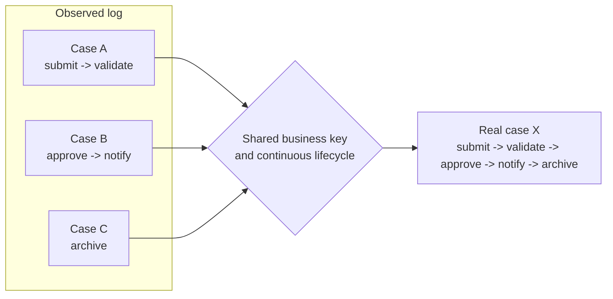

---
title: "Scattered Case"
category: "[[Log Imperfection/_Log Imperfection Patterns|Log Imperfection Patterns]]"
---
A scattered case occurs when events from one real process instance are split across several case identifiers. The log appears to contain multiple short cases, but those traces are fragments of one end-to-end instance.

**Intent:** Detect and repair trace fragmentation caused by changing identifiers, handovers between systems, duplicate case keys, or lifecycle phases recorded under separate IDs.

**Use when:** Several cases share a business object, customer, document, or transfer reference and their event sequences look like consecutive parts of one process.

**Modeling notes:** Merge only when the evidence supports a single process instance. Useful signals include explicit predecessor fields, shared object IDs, non-overlapping temporal continuity, and lifecycle constraints. Document the merge rule, because it changes frequency, duration, variant, and conformance results.

Source: [workflowpatterns.com](http://workflowpatterns.com/patterns/logimperfection/elp6.php).
