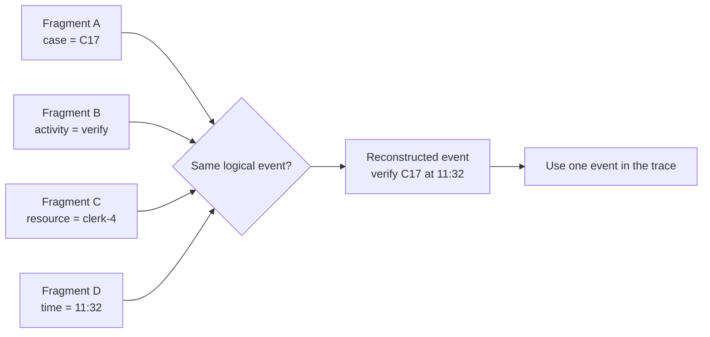

---
title: "Scattered Event"
category: "[[Log Imperfection/_Log Imperfection Patterns|Log Imperfection Patterns]]"
---
A scattered event is one logical event distributed across several records or sources. The activity name, timestamp, resource, object identifier, and payload needed to understand the event are not in one row, so the event must be reconstructed before it can support analysis.

**Intent:** Consolidate fragments that describe the same occurrence before treating them as separate process behavior.

**Use when:** Multiple records share a transaction identifier, correlation key, or close timestamp and each contributes part of one business event.

**Modeling notes:** Reconstruct the event using stable correlation keys first, then temporal proximity and attribute consistency. Be careful not to merge genuinely separate repeated actions. The result should be one event with combined attributes, plus provenance if the repair matters for auditability.

Source: [workflowpatterns.com](http://workflowpatterns.com/patterns/logimperfection/elp4.php).
