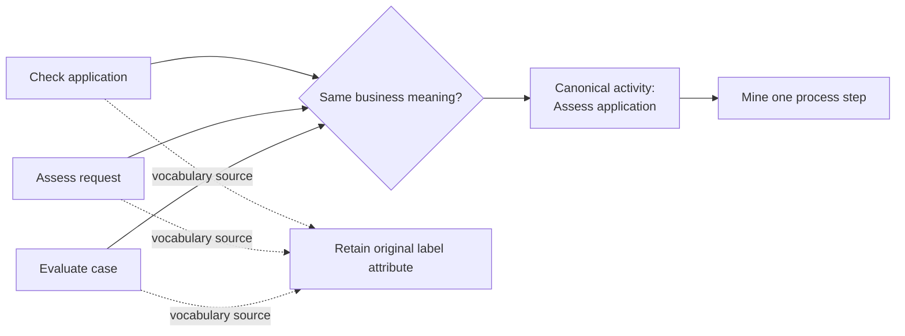

---
title: "Synonymous Labels"
category: "[[Log Imperfection/_Log Imperfection Patterns|Log Imperfection Patterns]]"
---
Synonymous labels are different activity names that refer to the same underlying process step. Unlike distorted labels, they may not look similar; the problem is semantic equivalence rather than spelling.

**Intent:** Align vocabulary differences across teams, systems, or time periods so that one activity is not mined as several unrelated steps.

**Use when:** Labels such as `Check application`, `Assess request`, and `Evaluate case` are used interchangeably for the same work in the same process context.

**Modeling notes:** Synonym repair usually needs domain knowledge. Behavioral position, resource role, input-output data, and expert review are stronger evidence than text similarity alone. Preserve the source vocabulary when it is useful for organizational analysis.

Source: [workflowpatterns.com](http://workflowpatterns.com/patterns/logimperfection/elp10.php).
