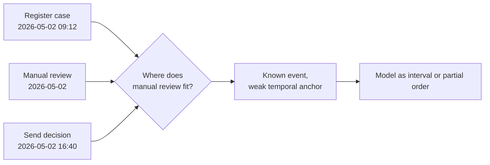

---
title: "Unanchored Event"
category: "[[Log Imperfection/_Log Imperfection Patterns|Log Imperfection Patterns]]"
---
An unanchored event has insufficient or misinterpreted timestamp information, so it cannot be reliably positioned in the trace. The event may have only a date, a local time without timezone, a rounded timestamp, or a timestamp parsed with the wrong format.

**Intent:** Represent an event whose occurrence is known but whose exact temporal anchor is weak or ambiguous.

**Use when:** The event belongs to a case, but its timestamp granularity or interpretation is too poor to determine its order against nearby events.

**Modeling notes:** Keep the event if it is behaviorally important, but model the temporal uncertainty explicitly. Use intervals, partial orders, confidence flags, or ordering constraints from the process model rather than inventing precision that the source did not record.

Source: [workflowpatterns.com](http://workflowpatterns.com/patterns/logimperfection/elp3.php).
