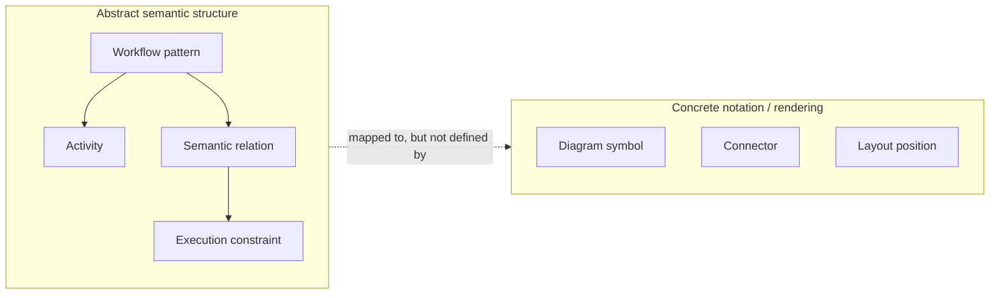

Source: [workflowpatterns.com](http://workflowpatterns.com/patterns/presentation/abstractsyntax/index.php).

Abstract Syntax is the presentation pattern concerned with the semantic shape of a workflow model before it is committed to a particular diagramming vocabulary, icon set, or textual notation. It identifies the concepts that must exist in the model, the relationships between those concepts, and the constraints that make a representation meaningful.

In workflow-pattern terms, abstract syntax is where the model says that there are activities, events, routing constructs, dependencies, splits, joins, conditions, and other semantic elements. It does not yet decide whether those elements will be rendered as BPMN gateways, Petri-net places and transitions, UML activity nodes, XML elements, or prose.

**Intent:** Define the notation-independent structure of a workflow pattern so the modeled meaning can be analyzed, compared, and transformed without relying on the accidental details of a drawing or text format.

**Use when:** - You need to compare workflow languages that use different concrete notations.
- You are designing a modeling language and need to define its semantic vocabulary before choosing symbols.
- You want tooling to validate, transform, or generate workflow models without depending on layout or rendering details.
- You need to explain the essence of a workflow pattern separately from how a specific product displays it.

**Modeling notes:** Abstract syntax should name the model elements and relationships that carry meaning. For example, a sequence pattern can be expressed as an ordering relationship between two activities, while a parallel split requires a point where one thread of control enables multiple branches. Those concepts remain stable even when the concrete notation changes.

Keep the abstract syntax small enough to support comparison. If it includes visual details such as arrow color, icon shape, swimlane position, or font style, it has drifted into concrete syntax. Conversely, if it omits ordering, enablement, synchronization, or branching constraints, it is too weak to explain the workflow behavior.

