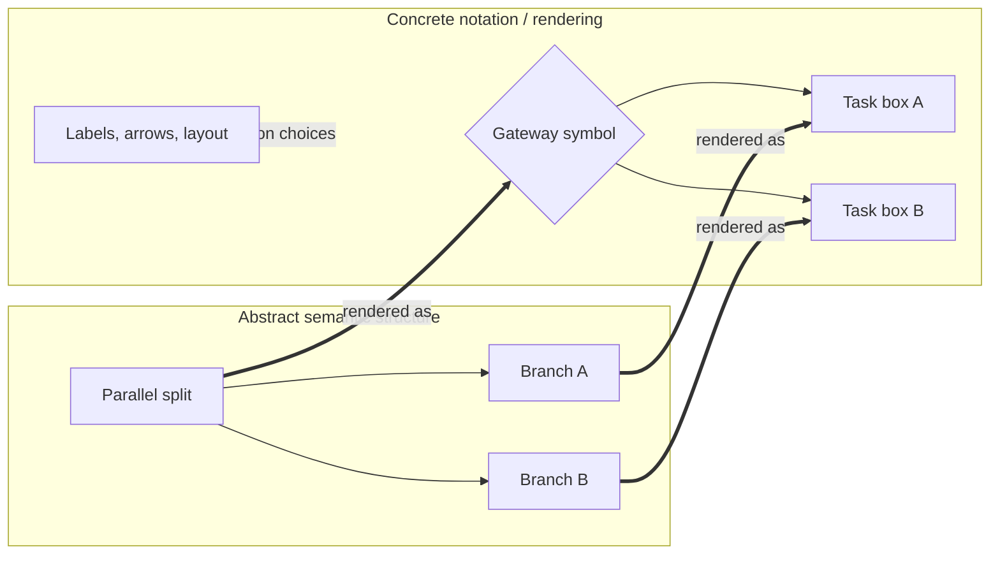

Source: [workflowpatterns.com](http://workflowpatterns.com/patterns/presentation/concretesyntax/index.php).

Concrete Syntax is the presentation pattern concerned with the notation that readers and tools actually see. It defines how abstract model elements are written, drawn, arranged, labelled, and rendered in a specific modeling language or documentation style.

Where abstract syntax says that a workflow model contains a split, a join, an activity, or a dependency, concrete syntax says how those ideas appear: as boxes and arrows, gateway diamonds, Petri-net nodes, indentation in a textual grammar, XML tags, color conventions, or rendered diagrams in an article.

**Intent:** Provide a clear, consistent notation for presenting workflow-pattern concepts so readers can recognize model elements, follow relationships, and inspect behavior in a concrete representation.

**Use when:** - You are documenting workflow patterns for humans who need a readable visual or textual form.
- You are implementing an editor, renderer, parser, or exporter for a workflow notation.
- You need to standardize how the same abstract concept appears across examples.
- You want to evaluate whether a notation makes the underlying workflow semantics visible or hides them behind ambiguous symbols.

**Modeling notes:** Concrete syntax should make the abstract structure legible without pretending that appearance is the same as meaning. Two diagrams may share the same abstract syntax while using different symbols, and two similar-looking diagrams may differ semantically if their notation assigns different behavior to the same shape.

Good concrete syntax makes mapping explicit. A reader should be able to tell which marks represent activities, which connectors represent ordering or flow, which symbols introduce choices or concurrency, and which labels carry guards or conditions. Layout can help comprehension, but it should not be the only place where semantics are encoded.

