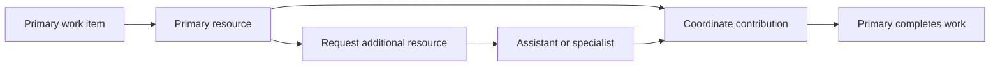

Intent: Add extra resources to support a primary resource on a work item.

Use when: The work needs consultation, assistance, approval support, translation, technical help, or temporary participation without fully replacing the primary assignee.

Modeling notes: Distinguish primary accountability from auxiliary participation. Model how additional resources are requested, what permissions they receive, and whether their contribution blocks completion.

Source: [workflowpatterns.com](http://workflowpatterns.com/patterns/resource/multiple_resources/wrp43.php).
