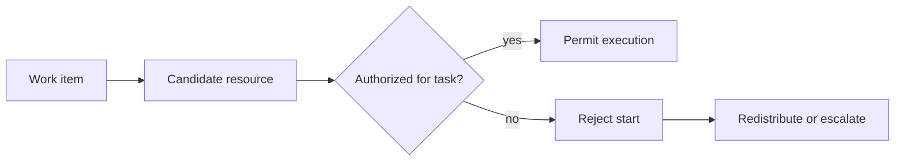

Intent: Restrict execution to resources that have permission to perform a work item.

Use when: Compliance, licensing, security, or business rules require a positive permission check before a resource can start or complete work.

Modeling notes: Treat authorization as a guard on execution, not merely as a distribution filter. A work item may be visible or allocated and still be blocked from execution if authorization changes.

Source: [workflowpatterns.com](http://workflowpatterns.com/patterns/resource/creation/wrp4.php).
