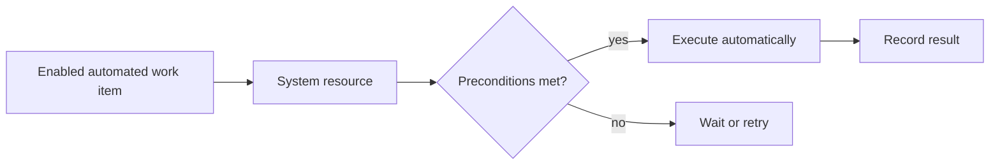

Intent: Start and execute a work item without waiting for a human resource to explicitly select it.

Use when: The task is performed by a system service, script, integration endpoint, or robot once the work item is enabled and prerequisites are satisfied.

Modeling notes: Separate automated execution from automatic allocation. The model should show which system resource performs the work, how retries are handled, and what failure state is visible to operators.

Source: [workflowpatterns.com](http://workflowpatterns.com/patterns/resource/creation/wrp11.php).
