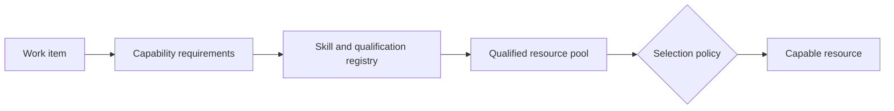

Intent: Route work to resources that possess required skills, qualifications, tools, or certifications.

Use when: Role membership is too broad and the work depends on concrete capabilities such as language, license, equipment access, or technical skill.

Modeling notes: Keep capability data current and distinguish mandatory capabilities from ranking preferences. Combine capability filters with workload and authorization rules when selecting one resource from a qualified pool.

Source: [workflowpatterns.com](http://workflowpatterns.com/patterns/resource/creation/wrp8.php).
