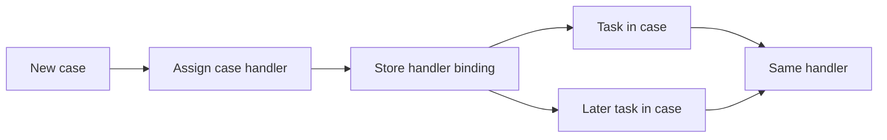

---
title: "Case Handling"
category: "[[Resources/_Resource Patterns|Resource Patterns]]"
---
Intent: Assign all work in a case, or a significant portion of it, to a single resource responsible for continuity.

Use when: Customer relationship, clinical care, claims handling, or case management benefits from one person maintaining context across many tasks.

Modeling notes: Model the case handler as a case-level binding and have later work items refer to that binding. Include reassignment rules for absence, escalation, or handover so the case is not stranded.

Source: [workflowpatterns.com](http://workflowpatterns.com/patterns/resource/creation/wrp6.php).
