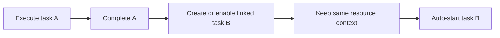

Intent: Automatically start a related follow-on work item after the current one finishes, preserving execution continuity.

Use when: A resource should carry through a sequence of dependent tasks without returning to a general selection step.

Modeling notes: Model the chain relationship explicitly so it is not mistaken for queue order. Chained execution is about a specific successor, not simply the next item in a backlog.

Source: [workflowpatterns.com](http://workflowpatterns.com/patterns/resource/autostart/wrp39.php).
