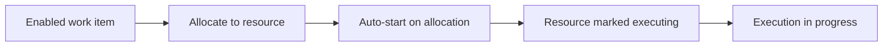

---
title: "Commencement on Allocation"
category: "[[Resources/_Resource Patterns|Resource Patterns]]"
---
Intent: Start a work item automatically when it is allocated to a resource.

Use when: Allocation is a strong enough commitment that execution should begin without an additional start action.

Modeling notes: Keep this distinct from distribution by allocation. The allocation rule chooses the resource; commencement on allocation defines that start follows immediately after that choice.

Source: [workflowpatterns.com](http://workflowpatterns.com/patterns/resource/autostart/wrp37.php).
