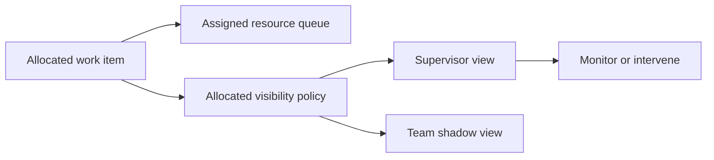

Intent: Configure who can see work items that are already allocated to a resource.

Use when: Supervisors, team members, substitutes, auditors, or case collaborators need controlled visibility into assigned work.

Modeling notes: Decide whether visibility grants read-only awareness, operational control, delegation rights, or execution rights. Allocated visibility often interacts with escalation, substitution, and workload monitoring.

Source: [workflowpatterns.com](http://workflowpatterns.com/patterns/resource/visibility/wrp41.php).
