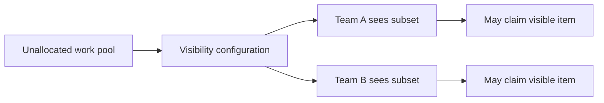

---
title: "Configurable Unallocated Work Item Visibility"
category: "[[Resources/_Resource Patterns|Resource Patterns]]"
---
Intent: Configure which unallocated work items resources can see before any claim or assignment occurs.

Use when: Shared pools should be visible only to certain roles, teams, locations, priorities, or subscription groups.

Modeling notes: Visibility is not allocation. A visible unallocated item can usually be claimed, offered, or ignored depending on the pull policy, so model visibility filters separately from claim rules.

Source: [workflowpatterns.com](http://workflowpatterns.com/patterns/resource/visibility/wrp40.php).
