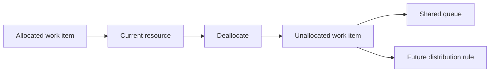

Intent: Remove an existing allocation so the work item is no longer assigned to the current resource.

Use when: A resource becomes unavailable, the assignment was wrong, the item must return to a shared pool, or responsibility should be cleared before redistributing.

Modeling notes: Deallocation is not the same as reallocation. Model it as a transition to unallocated state; a separate rule may then offer, allocate, suspend, or cancel the item.

Source: [workflowpatterns.com](http://workflowpatterns.com/patterns/resource/detour/wrp29.php).
