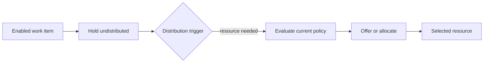

Intent: Delay the choice of resource until a later point, usually closer to execution.

Use when: Eligibility, workload, location, availability, or case state may change between enablement and the moment the task is actually needed.

Modeling notes: Keep the work item enabled but undistributed, and define the later trigger that performs distribution. This avoids stale assignments but requires clear queue and timeout semantics while the item waits.

Source: [workflowpatterns.com](http://workflowpatterns.com/patterns/resource/creation/wrp3.php).
