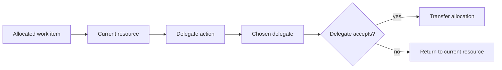

Intent: Allow a resource responsible for a work item to pass responsibility to another resource.

Use when: The current assignee lacks time, expertise, authority, or proximity, but can identify a better resource to continue the work.

Modeling notes: Model delegation as an intentional resource action and record both delegator and delegate. Decide whether delegation transfers full accountability or creates a subordinate responsibility relationship.

Source: [workflowpatterns.com](http://workflowpatterns.com/patterns/resource/detour/wrp27.php).
