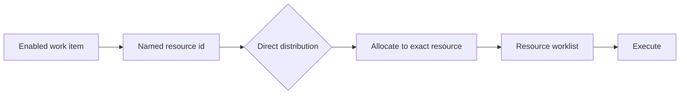

Intent: Allocate or offer a work item to one specifically identified resource, independent of role lookup or dynamic selection.

Use when: A case has a named owner, a specialist must perform the task, or an upstream decision records the exact person or system that should receive the work.

Modeling notes: Model the resource identity as case data, a binding, or an explicit assignment rule. Keep direct distribution separate from authorization: naming a resource says where the item goes; an authorization rule still says whether that resource may execute it.

Source: [workflowpatterns.com](http://workflowpatterns.com/patterns/resource/creation/wrp1.php).
