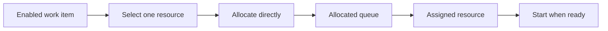

---
title: "Distribution by Allocation - Single Resource"
category: "[[Resources/_Resource Patterns|Resource Patterns]]"
---
Intent: Allocate a work item directly to one selected resource without an intermediate offer.

Use when: The system has authority to assign responsibility and the resource is expected to perform the task once it appears in the allocated queue.

Modeling notes: Allocation changes accountability, so model reassignment, refusal, and escalation separately if they are permitted. Do not use offer terminology for this pattern; the resource is assigned, not invited.

Source: [workflowpatterns.com](http://workflowpatterns.com/patterns/resource/push/wrp14.php).
