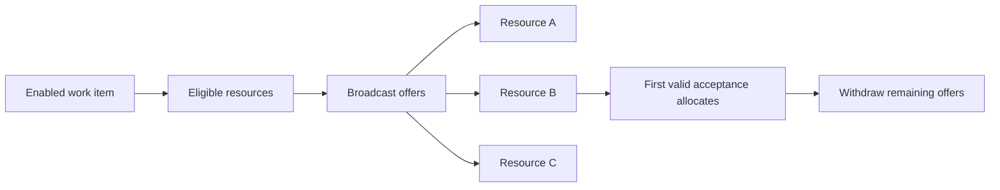

Intent: Offer a work item to several resources and allocate it to the one that accepts according to the offer policy.

Use when: Several eligible resources can perform the task and the system wants competition, availability discovery, or quick uptake without preselecting one assignee.

Modeling notes: Define whether the first acceptance wins, whether offers are broadcast or staggered, and how losing offers are withdrawn after allocation.

Source: [workflowpatterns.com](http://workflowpatterns.com/patterns/resource/push/wrp13.php).
