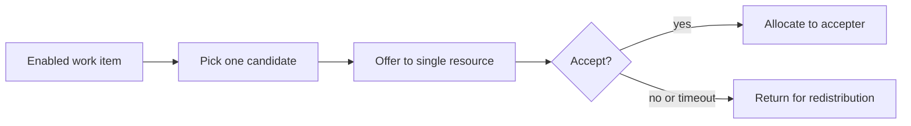

---
title: "Distribution by Offer - Single Resource"
category: "[[Resources/_Resource Patterns|Resource Patterns]]"
---
Intent: Offer a work item to one resource, allowing that resource to accept or ignore it before allocation occurs.

Use when: The system should nominate a single candidate but the resource retains the choice to take responsibility.

Modeling notes: Represent offer state explicitly because the work item is not yet allocated. Define offer expiry, decline behavior, and whether other resources can see the item while the offer is pending.

Source: [workflowpatterns.com](http://workflowpatterns.com/patterns/resource/push/wrp12.php).
