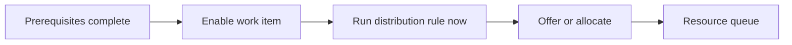

Intent: Distribute a work item at the moment it becomes enabled.

Use when: The normal policy is to decide resource responsibility as soon as the control-flow prerequisites are satisfied.

Modeling notes: This is the default timing for many workflow engines. Make the enablement event explicit when comparing it with early and late distribution because the same allocation rule can be applied at different times.

Source: [workflowpatterns.com](http://workflowpatterns.com/patterns/resource/push/wrp19.php).
