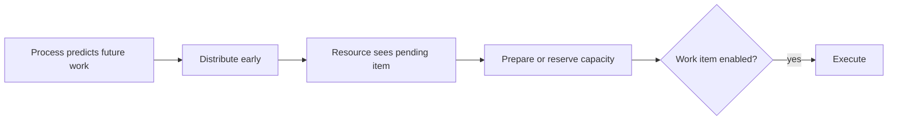

---
title: "Early Distribution"
category: "[[Resources/_Resource Patterns|Resource Patterns]]"
---
Intent: Distribute a work item before it is ready to execute, often while upstream process steps are still running.

Use when: Resources need advance notice, scheduling time, preparation, or reservation before the activity becomes executable.

Modeling notes: Model early distribution as a pre-enablement state and keep start conditions distinct. The resource may know about the task before the process token can legally execute it.

Source: [workflowpatterns.com](http://workflowpatterns.com/patterns/resource/push/wrp18.php).
